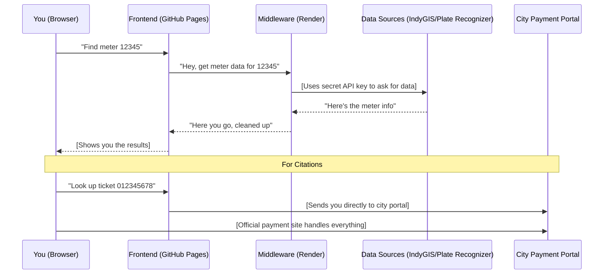

# Open Curb
**[Launch Application](https://dugann.github.io/indy-locator-web/)**

[](https://github.com/dugann/indy-locator-web)
[](https://react.dev/)
[](https://render.com/)
[](#important)

**Open Curb** is a mobile-first Progressive Web App that makes parking and citations in Indianapolis actually manageable. Find meters by ID or street name. Look up citations by ticket number or license plate. All without downloading anything from an app store or creating an account.

Think of it like having a direct line to the city's parking data—but through an interface that actually makes sense.

> **Important:** This is an independent project. It's not sponsored by, affiliated with, or endorsed by the City of Indianapolis. It's just built by someone who thought the parking experience could be better.

---

## Your Privacy is Non-Negotiable

Here's the thing about entering license plate numbers and ticket information: it feels invasive. So here's the deal—**Open Curb operates on a strict "Zero-Retention" policy**.

* **Nothing is logged.** Your searches aren't saved, tracked, or stored anywhere.
* **No server-side memory.** When you search for a meter or look up a ticket, the request is processed and immediately forgotten. Like a conversation that never happened.
* **No cookies for tracking.** The app doesn't watch what you're doing or build a profile on you.
* **Session amnesia.** Close the page, and everything you entered vanishes. It's like erasing a whiteboard.

Think of it this way: if this app were a librarian, it would hand you the book you asked for and then immediately forget you were ever there.

---

## How Information Flows: The Middle Man Explained

You know how when you go to a bank, the teller doesn't hand you the vault keys? That's basically what's happening here. The frontend (what you see in your browser) never gets direct access to sensitive API keys. Instead, everything goes through a secure middleware—like a bouncer checking IDs before letting anyone into the club.



**Why this matters:** API keys are like house keys. You don't leave them lying around. By routing everything through a secure server, those keys stay locked up where they belong.

---

## Citations: We Don't Touch Your Money

When you look up a citation, Open Curb does **exactly two things**:

1. **Checks if the ticket number is valid** using something called the Luhn algorithm (it's like a spell-checker for numbers—if the format is wrong, it catches it before bothering the city's servers).
2. **Sends you directly to the official Indianapolis payment portal**. That's it. We're out of the picture.

Open Curb never sees your payment info, never processes transactions, and never sits between you and the city's financial system. It's a door that opens and then gets out of your way.

---

## The Technical Stuff (In Plain English)

### What It's Built With

**Frontend (What You See)**
- **React 18** - Think of this as the framework that makes the app interactive. It's what lets buttons do things when you click them.
- **Tailwind CSS** - This handles how everything looks. Instead of writing custom style rules, it uses pre-made building blocks. Like LEGOs for design.
- **Lucide React** - The icon library. Those little magnifying glasses and map pins? That's Lucide.
- **Pre-compiled JSX** - Here's where it gets interesting. React uses JSX (a mix of JavaScript and HTML), but browsers don't understand JSX natively. So we compile it beforehand—like translating a book before publishing it, rather than expecting readers to translate as they read.

**Backend (The Behind-the-Scenes Stuff)**
- **Node.js/Express** - The middleware server that handles API requests and keeps your keys secure.
- **Hosted on Render** - This is where the backend lives. Fair warning: it's on a free tier, which means the first request after a period of inactivity can take 30-50 seconds while the server "wakes up." Think of it like a laptop coming out of sleep mode.

**Hosting**
- **GitHub Pages** - Where the frontend lives. Free, fast, and reliable.
- **Progressive Web App (PWA)** - You can "install" this app on your phone without going through an app store. It's just a website that acts like a native app.

### Why Pre-Compilation Matters

Here's the deal: browsers speak JavaScript. React speaks JSX. Traditionally, apps would translate JSX to JavaScript *in the browser*, every time the page loads. That works, but it's inefficient—like having a translator read a book aloud to you instead of just reading the translated book yourself.

By compiling JSX to JavaScript before deployment, the browser gets code it already understands. No translation needed. Faster load times, better performance, and one less thing that can go wrong.

**How it works:**
1. We write code in JSX (developer-friendly)
2. Babel translates JSX → JavaScript (browser-friendly)
3. The browser gets pure JavaScript (no extra work required)

---

## Building It Yourself

If you want to build this from source or contribute, here's what you need:

### Prerequisites
- **Node.js 16+** and npm (the JavaScript ecosystem's package manager)
- **Python 3.7+** (for the build scripts)

### Build Process

```bash
# 1. Install the compilation tools
npm install @babel/cli @babel/core @babel/preset-react @babel/preset-env

# 2. Run the build script
python build_WORKING.py

# Output: index_working.html (production-ready file)
```

**What the build script does:**
1. **Extracts the React code** from the source HTML (it's embedded in a `<script>` tag)
2. **Compiles JSX → JavaScript** using Babel with ES module output (browser-native format)
3. **Removes development tools** (like the Babel CDN that was doing runtime compilation)
4. **Bundles everything** into a single production-ready HTML file

### Deploy

Upload these files to GitHub Pages:
- `index.html` (the compiled file—rename `index_working.html`)
- `manifest.json` (PWA configuration)
- `service-worker.js` (offline caching)
- Icon files (`icon-192.png`, `icon-512.png`, logos, etc.)

---

## Security

- **Client-side validation** - Ticket numbers are checked locally using the Luhn algorithm before ever hitting a server
- **API keys never exposed** - All sensitive credentials live on the backend server
- **HTTPS everywhere** - All communication is encrypted
- **No authentication required** - The app is stateless and doesn't need you to log in

---

## Why This Exists

Parking enforcement data should be accessible. Citation lookup shouldn't require navigating a maze of city websites. And checking meter locations shouldn't feel like detective work.

This is a tool built out of frustration with unnecessarily complicated systems. It connects directly to Indianapolis's open data and makes it actually usable.

---

## Author

Built by **William Dugann**

* [GitHub](https://github.com/dugann/indy-locator-web)
* [LinkedIn](https://www.linkedin.com/in/dugann/)
* [Report Issues](https://github.com/dugann/indy-locator-web/issues)

---

## License

This project is proprietary. It's publicly viewable for transparency, but not licensed for redistribution or commercial use.
