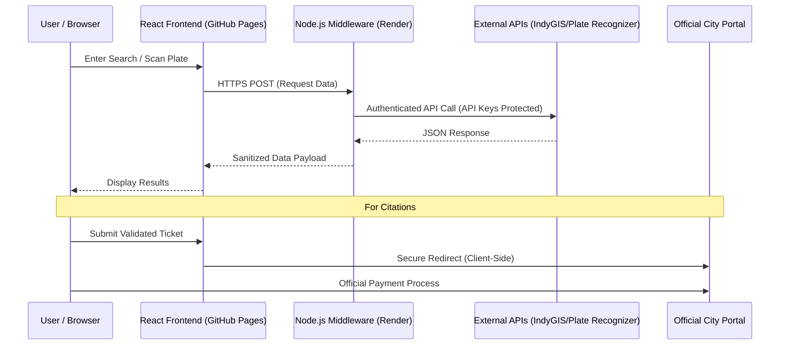

# Open Curb
**[Launch Application](https://dugann.github.io/indy-locator-web/)**

[](https://github.com/dugann/indy-locator-web)
[](https://react.dev/)
[](https://render.com/)
[](#important)

**Open Curb** is a welcoming, mobile-first Progressive Web App designed to simplify how you navigate parking and citations in Indianapolis. Whether you are looking for a specific meter or checking a citation, the goal is to eliminate friction and provide a professional, transparent interface.

The application works directly in any browser or can be installed as an app on a mobile device straight from the website, with no app store or account creation required.

> **Important:** Open Curb is a private, independent effort. It is not sponsored by, supported by, or affiliated with the City of Indianapolis.

---

## Your Privacy is the Priority

Entering license plate numbers or ticket information can feel sensitive. **Open Curb is built on a "Zero-Retention" philosophy**.

* **No Data Logging:** The application does not save, retain, or log any information entered.
* **No Server-Side Storage:** Meter searches, ticket numbers, and license plates are processed to complete the request and are never stored on a server.
* **No Tracking:** The application does not use cookies for user tracking or usage profiling.
* **Session Security:** All searches are discarded the moment the page is closed.

---

## API & Architecture: Transparent Traffic Flow

The diagram below illustrates the flow of API traffic. To ensure security, sensitive API keys are never exposed on the frontend. Instead, traffic is routed through a secure Node.js middleware that communicates with official data sources.



---

## Citation Lookup: Safe and Redirect-Only

The citation lookup feature is a "redirect-only" service to the **official Indianapolis citation payment portal**. Open Curb never handles payments or sits between the user and the official financial system.

### How It Works

1. **Format Validation:** The application checks the ticket number using the Luhn algorithm locally.
2. **Secure Redirect:** The user is sent directly to the city's official site.
3. **Official Processing:** All balances, citation details, and payments happen exclusively on the official portal.

---

## Technical Details

**Open Curb** utilizes a modern, decoupled architecture to ensure both performance and security.

### Frontend Stack
* **React 18** - Component framework with ES module imports
* **Tailwind CSS** - Utility-first styling via CDN
* **Lucide React** - Icon library
* **Pre-compiled JSX** - Babel-transformed for production (no runtime JSX transformation)

### Backend Services
* **Node.js/Express** middleware that proxies requests to IndyGIS and Plate Recognizer APIs
* **Hosted on Render** with cold-start behavior on free tier (first request may take 30-50s)

### Hosting & Deployment
* **GitHub Pages** - Static frontend hosting
* **Render** - Backend API middleware
* **Progressive Web App** - Installable on mobile devices with service worker caching

### Build Process
The application is compiled from JSX to production-ready JavaScript:
* **Babel 7+** with `@babel/preset-react` and `@babel/preset-env`
* **ES Modules** output for native browser compatibility
* **No runtime compilation** - all JSX pre-transformed for performance

---

## Development & Building

### Prerequisites
* Node.js 16+ and npm
* Python 3.7+ (for build scripts)

### Build from Source
```bash
# Install dependencies
npm install @babel/cli @babel/core @babel/preset-react @babel/preset-env

# Run build script
python build_WORKING.py

# Output: index_working.html (production-ready)
```

The build script:
1. Extracts JSX from source HTML
2. Compiles with Babel to ES modules
3. Removes development-only CDN scripts
4. Generates production HTML with compiled code

### Deploy
Upload these files to GitHub Pages:
* `index.html` (the compiled production file)
* `manifest.json`
* `service-worker.js`
* Icon files (`icon-192.png`, `icon-512.png`, etc.)
* Logo files

---

## Security & Validation

* **Client-side citation validation** using Luhn algorithm
* **API keys** secured in backend middleware, never exposed to frontend
* **HTTPS-only** communication for all API requests
* **No authentication required** - stateless operation

---

## Author

Built by **William Dugann**

* [GitHub Repository](https://github.com/dugann/indy-locator-web)
* [LinkedIn](https://www.linkedin.com/in/dugann/)
* [Report Issues](https://github.com/dugann/indy-locator-web/issues)
