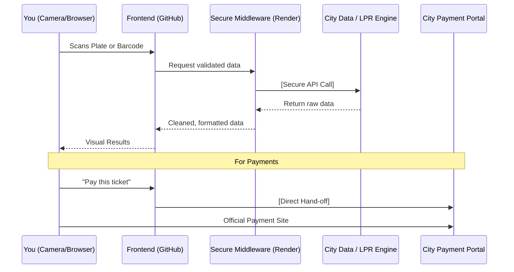

# Open Curb
**[Launch Application](https://dugann.github.io/indy-locator-web/)**

**Open Curb** is a mobile-first Progressive Web App (PWA) designed to make parking and citations in Indianapolis manageable. Find meters by ID, search by street name, or look up citations by ticket number and license plate, all without app store downloads or account registration.

---

## Intelligent Tools for Fast Access

Open Curb is designed for speed, especially when you're standing at a meter or holding a ticket in the rain.

* **Dual-Mode Interface:** Seamlessly toggle between **Parking Finder** (to locate meters and street info) and **Citation Lookup** (to check ticket status).
* **License Plate Recognition (LPR):** Use your phone’s camera to scan your plate instantly. Our built-in reader eliminates typing errors and gets you to your data faster.
* **Barcode Scanning:** Received a ticket? Don't fumble with long citation numbers. Scan the barcode directly from the physical slip to pull up the official record.
* **Zero-Download Install:** As a PWA, you can "install" Open Curb to your home screen directly from your browser. It’s lightweight, fast, and stays out of your way.

---

## Your Privacy is Non-Negotiable

Entering a license plate or scanning a ticket can feel invasive. Open Curb is built on a **Zero-Retention** philosophy to ensure your data stays yours.

* **No Logging:** Your search queries, plate scans, and ticket IDs are never saved or stored.
* **Stateless Processing:** When you use the camera or search bar, the request is processed in real-time and immediately discarded. 
* **No Tracking:** There are no tracking cookies or user profiling scripts.
* **Camera Privacy:** Camera access is used solely for local scanning and is never recorded or uploaded to a third-party server.

---

## How Information Flows

To keep sensitive data and API keys secure, Open Curb uses a "Middle Man" architecture. Your browser never talks directly to external data providers; instead, it communicates through a secure gateway.

---

## Technical Architecture

### The Stack
* **Frontend:** Built with **React 18** and **Tailwind CSS**.
* **Computer Vision:** Integrated scanning logic for high-speed license plate and barcode recognition.
* **Middleware:** A **Node.js/Express** server hosted on Render handles secure API proxying and LPR processing. 
    * *Note: On the free tier, the server may take 30 seconds to "wake up" if it hasn't been used recently.*
* **Hosting:** The UI is served via **GitHub Pages** for maximum reliability.

### Install as an App
* **iOS:** Tap **Share** → **"Add to Home Screen."**
* **Android:** Tap **Menu** → **"Install App."**

---

## Author

Built by **William Dugann**

* [GitHub](https://github.com/dugann/indy-locator-web)
* [LinkedIn](https://www.linkedin.com/in/dugann/)
* [Report Issues](https://github.com/dugann/indy-locator-web/issues)

---

## License

This project is proprietary. The source code is publicly viewable for transparency and security auditing, but it is not licensed for redistribution or commercial use.
