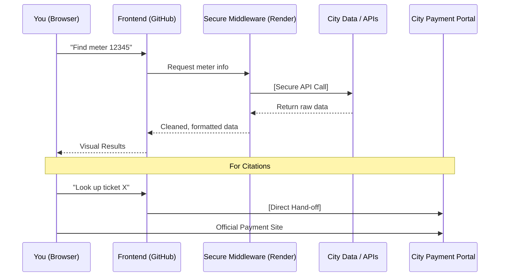

# Open Curb
**[Launch Application](https://dugann.github.io/indy-locator-web/)**

**Open Curb** is a mobile-first Progressive Web App (PWA) designed to make parking and citations in Indianapolis manageable. Find meters by ID, search by street name, or look up citations by ticket number and license plate, all without app store downloads or account registration.

Think of it as a clean, intuitive lens for the city's parking data.

> **Important:** This is an independent project. It is not sponsored by, affiliated with, or endorsed by the City of Indianapolis. It was built to solve a specific problem: making the local parking experience more user-friendly.

---

## Your Privacy is Non-Negotiable

Entering a license plate or ticket number can feel invasive. Open Curb is built on a **Zero-Retention** philosophy to ensure your data stays yours.

* **No Logging:** Your search queries, plate numbers, and ticket IDs are never saved, tracked, or stored.
* **Stateless Processing:** When you look up a meter or ticket, the request is processed in real-time and immediately discarded. 
* **No Tracking:** There are no tracking cookies or user profiling scripts.
* **Session Amnesia:** Closing the browser tab wipes the slate clean. It’s like a conversation that never happened.

---

## How Information Flows

To keep sensitive data and API keys secure, Open Curb uses a "Middle Man" architecture. Your browser never talks directly to external data providers; instead, it communicates through a secure gateway.

**Why this matters:** This architecture ensures that API credentials stay locked on the server, never exposed to the public internet or the client-side code.

---

## Payments & Citations

Open Curb is a discovery tool, not a payment processor. 

1.  **Validation:** We use local logic to verify ticket formats before querying the city, saving you time.
2.  **The Hand-off:** Once a valid citation is identified, we provide a direct link to the **Official Indianapolis Payment Portal**. 

We never see your credit card info, we never process transactions, and we never sit between you and the city’s financial systems.

---

## Technical Architecture

### The Stack
* **Frontend:** Built with **React 18** and styled with **Tailwind CSS**. We use **Lucide** for a consistent, lightweight iconography set.
* **Performance:** The code is pre-compiled and bundled, ensuring the browser receives lean, production-ready JavaScript for fast execution on mobile hardware.
* **Middleware:** A **Node.js/Express** server hosted on Render handles secure API proxying. 
    * *Note: On the free tier, the server may take 30 seconds to "wake up" if it hasn't been used recently.*
* **Deployment:** The UI is hosted on **GitHub Pages**, providing high availability and fast global delivery.

### Install as an App
Since this is a PWA, you can add it to your home screen for an "app-like" experience without the App Store:
* **iOS:** Tap the **Share** icon and select **"Add to Home Screen."**
* **Android:** The easiest way to install this as an app is to tap the download icon at the top right of your screen. You can also tap the **Three Dots** and select **"Install App"** or **"Add to Home Screen."**

---

## Security
* **SSL/TLS:** All traffic is encrypted via HTTPS.
* **Credential Isolation:** API keys are stored in environment variables on the backend, never in the frontend code.
* **No Auth Required:** By design, the app does not require a login, eliminating the risk of credential leaks.

---

## Author

Built by **William Dugann**

* [GitHub](https://github.com/dugann/indy-locator-web)
* [LinkedIn](https://www.linkedin.com/in/dugann/)
* [Report Issues](https://github.com/dugann/indy-locator-web/issues)

---

## License

This project is proprietary. The source code is publicly viewable for transparency and security auditing, but it is not licensed for redistribution or commercial use.
